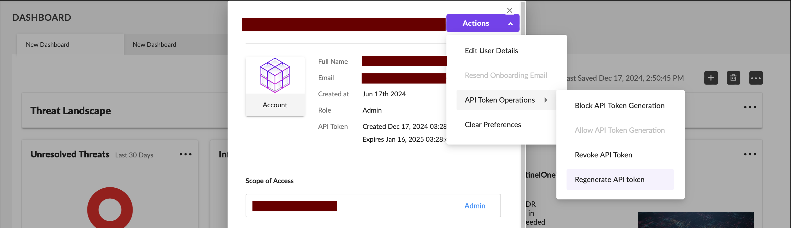
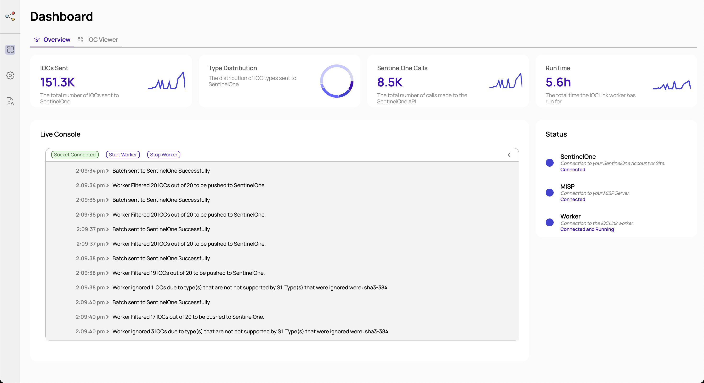

# iOCLink 🔗
**Version 1.0.1**

iOCLink is a Platform that allows IOCs to be automatically processed and pushed from an Intelligence Server to a SentinelOne Instance, effectively allowing them to be synchronised. Some core features iOCLink offers are the following: 

- **An Autonomous Worker:** 🤖 to handle IOC retreival, processing and pushing **continuously** and **automatically** based on defineable scheduling. 

- **A Live Console:** 🖥️ to view the actions of and interact with the Worker in real-time. 

- **An IOC Viewer:** 🔍 to explore the IOCS present and created in your SentinelOne Instance. 

<br>

Its lightweight, containerised design means that it can be installed directly to a pre-existing Server, or run on its own dedicated machine - the choice is yours! 


<br>

#### Notes
- At present, iOCLink only supports synchronisation with MISP Servers. There is not yet an option to Connect to a TAXII Feed or Server. 

- **This software is provided as a community-driven project and is not officially supported by SentinelOne. It is offered on an "as-is" basis, without warranties or guarantees, either express or implied. Users are encouraged to thoroughly test and validate the software before deploying it in their environments. While community contributions and feedback are welcome, SentinelOne does not provide formal technical support, maintenance, or updates for this project.**

<br>

## Quick Start ⚡

```bash
# 1. Clone the repository
git clone https://github.com/maximus-debski/ioclink.git
cd ioclink

# 2. Run the installation script
python install.py

# 3. Configure the Management Console credentials in .env
nano .env

# 4. Start iOCLink
docker-compose up -d
```

After starting iOCLink, a run will be automatically scheduled to occur in the coming hours.

<br>
<br>

You can access the Management Console by navigating to the following URL:


```bash
http://<machine_public_ip>:<configured_port>
```

<br>


From here, **you will need to define your SentinelOne and MISP Server Configurations** to get the Worker configured correctly. See [Required Credentials](#required-credentials) and [Configurations](#configurations) for more information.


<br>

## Table of Contents
- [iOCLink 🔗](#ioclink-)
- [Quick Start ⚡](#quick-start-)
- [Requirements 📋](#requirements-)
  - [OS 💻](#os-)
  - [Software 🛠️](#software-️)
  - [Hardware ⚙️](#hardware-️)
- [Features ✨](#features-)
  - [The Worker 🤖](#the-worker-)
  - [The Management Console 🎛️](#the-management-console-️)
  - [SentinelOne Specifications 📝](#sentinelone-specifications-)
- [Installation In Depth 🔧](#installation-in-depth-)
- [Accessing The Management Console](#accessing-the-management-console)
- [Required Credentials 🔑](#required-credentials-)
  - [SentinelOne](#sentinelone)
  - [MISP Server](#misp-server)
- [The Dashboard 📊](#the-dashboard-)
  - [Worker Stats 📈](#worker-stats-)
  - [iOCLink Status 🚦](#ioclink-status-)
  - [Live Console 💻](#live-console-)
  - [IOC Viewer 🔍](#ioc-viewer-)
- [Configurations ⚙️](#configurations-️)
  - [SentinelOne Configurations](#sentinelone-configurations)
  - [MISP Server Configurations](#misp-server-configurations)
  - [Worker Configurations](#worker-configurations)
- [Logs 📜](#logs-)
  - [Run Information](#run-information)

<br>

## Requirements 📋

### OS 💻

iOCLink is designed to run on both ARM and AMD64 Debian-based Linux-based operating systems and has been tested thoroughly on a myriad of Ubuntu releases. 

**Reccomended Operating System:** Ubuntu 22.04 LTS

<br>

### Software 🛠️

The only software required for iOCLink to work is Docker Compose (and by extension Docker itself). They can be installed by running the following: 

```bash
sudo apt-get install docker-compose
```

<br>

### Hardware ⚙️

- **RAM:** at least 1GB. 

- **CPU:** at least 1vCPU, ARM or AMD64.

- **Storage:** at least 3GB, required especially to account for potential large log files. 


<br>


## Features ✨
At its core, iOCLink is comprised of two key components: the `Management Console` and the `iOCLink Worker`. Working in Unison, these systems provide a seamless and automatic syncing of IOC feeds to a SentinelOne Instance when configured properly. 

<br>

### The Worker 🤖
The worker is responsible for all the heavy lifting, handling the actual process of consuming, analysing, converting and then pushing streams of IOCs to SentinelOne. The process through which this is completed is known as a `run`. 

A run encompasses the aforementioned processing IOCs from a set `last_run_time` until the present or until the Worker has stopped. Runs can either be scheduled or manual:

**Scheduled Runs**: Occurs at a time and interval based on your configurations in the Management Console. 

**Manual Runs**: Occurs when the `Start Worker` button is triggered on the `Live Console` of the Management Console. 

<br>

### The Management Console 🎛️

The Management Console is designed to work in assistance with the Worker. It harbours a myriad of functionalities such as: allowing you to see your Worker's Statistics and its Connection to SentinelOne and Misp, View Log files of Runs, and Watch and control a Live Console of the Worker and any current Runs.

However, the most important aspect of the Management Console is its ability to allow you to Configure the Worker and its connected SentinelOne Instance and MISP Server. 

<br>

### SentinelOne Specifications 📝
SentinelOne only accepts IOCs of the following types:
- **SHA-256**
- **SHA-1**
- **MD5**
- **IPV4**
- **DOMAIN**
- **URL**

As such, IOCs present in any Server that are of an unsupported type will be ignored by the Worker as they cannot be pushed to SentinelOne. 

<br>

## Installation In Depth 🔧
**1. Clone the iOCLink Repository**

In order to run iOCLink, you will first need to clone its repository. On your machine, run the following:
```bash
git clone https://github.com/maximus-debski/ioclink.git
cd ioclink
```
You'll then need to access the created `ioclink` directory in order to continue.

<br>

**2. Run the Installation Script**

iOCLink comes with an easy-to-use installation script that will handle the generation of your encryption keys, assist in setting up your timezone configurations and more. 

To use it, simply run the following in the `ioclink` directory :
```bash
python install.py
```
<br>

The script will first check to see that the required dependencies: docker and docker-compose are installed. If they aren't, make sure to install them (see [Requirements](#requirements))

<br>

```bash
Checking dependencies...
✅ Docker is installed
✅ Docker Compose is installed
```

<br>

Once you have passed the dependencies check, you'll be prompted to enter a path. This is where your iOCLink Configurations and Logs will be saved. Entering a non-existent directory will lead the script to attempt to create it. 

```bash
Enter the path you would like your iOCLink configuration files and logs to be saved to.

Path: ./
✅ Using existing directory: /Users/max/Desktop/ioclink
```

<br>

Following this, you will be asked to enter the port at which you would like your Management Console to be accessible from.

<br>

```bash
Enter the port you would like the Web Console to run on (1024-65535). Please ensure this port is not already in use.
Port: 4099
```

<br>

Finally, you'll be required to enter a TimeZone in IANA TimeZone format following: **Region/City**. This value will convert all date-time values from UTC for use in the Management Console.

<br>

```bash
Enter timezone (e.g., Australia/Melbourne)
Timezone: Sydney/Melbourne
```

<br>
<br>


**3.  Configure Management Console Credentials**

After this, you will need to set the credentials you'd like to use when logging in to the Management Console. This can be done by editing the environment variables in the `.env` file. 

```bash
nano .env
```
Once in the `.env` file, edit the following records to include plain strings of the desired username and password you would like to use. 
```bash
WEBUI_USER=<insert_username_here>
WEBUI_PASS=<insert_password_here>
```

Now, save the `.env` file and your credentials will be set! These can be changed at any time through this method. 

<br>
<br>

**4. Run iOCLink**

Now that everything is setup, you can run iOCLink via the following:

```bash
docker-compose up -d
```
<br>

**As part of the initial setup, a Run will be scheduled to trigger in ~ 2 hours' time.** This can be viewed and configured in the **Configurations** page of the Console.

<br>


## Accessing The Management Console
In order to access the iOCLink Management Console, head to the following URL:
```bash
http://<machine_public_ip>:<configured_port>
```
If everything has been configured correctly, you'll be met with a Login Page. 

If you run into any troubles, make sure that your **firewall is configured to allow external access from the port you selected**, this can be done so in Ubunutu via the following: 

```bash
sudo ufw allow <selected_port_number>
sudo ufw reload
```

<br>


<br>

From here, enter the credentials that you set in the `.env` file and click login. Once logged in, you'll be greeted with the Management Dashboard.

<br>

## Required Credentials 🔑
There are a number of details and credentials you will need to retrieve in order to create a connection between iOCLink, your SentinelOne Instance and your MISP Server. 

### SentinelOne

1. **API Token**

- Click on your email address in the top right corner of the menu on the SentinelOne Console. 
- Click the `Actions` dropdown button and hover over `API Token Operations`.
- Click `Generate API token` and proceed with the required Authentication.



- **Note:** you do not need to include the `'APIToken '`component of the string in any configs


<br>

2.  **Console URL**

Your SentinelOne URL is simply the first component of the URL you use to access the console.


For example, for the above image, your input for the URL would simply be `https://usea1-purple.sentinelone.net/`

<br>

3. **Account or Site ID**

Depending on whether you want to connect to a SentinelOne Account or Site, navigate to the Settings and Info page of the corresponding option and retrieve the displayed ID.


<br>

### MISP Server

1. **API Key**

In order to retrieve your MISP API key you must complete the following:

- Locate and click on your profile name in the top-right corner of the interface and select Account Settings.

- Scroll down to the Auth keys section.

- Copy the Automation API key displayed here.


<br>

2. **Server URL**

Similar to your SentinelOne URL, your MISP Server URL is simply the base URL used to access your instance. 

<br>


<br>


## The Dashboard 📊

The Management Console's Dashboard will provide you with an overview of your setup, allowing you to not only review everything pertaining to your Worker but to also interact with it in real-time.

<br>



<br>

### Worker Stats 📈

The dashboard provides an overview of four key metrics, those being: 

- The number of IOCs the iOCLink Worker has sent in its lifetime.

- The distribution of said IOCs by type. Note, you can hover over each element of the distribution to view the type it is referencing as well as the number of IOCs of that type the Worker has sent. 

- The number of calls the Worker has made to the SentinelOne API.

- The amount of time it has been actively running. 

### iOCLink Status 🚦

The status widget provides you with the ability to check the status of a number of pivotal components of your setup. 

**Each of these can be clicked on to 're-check' any items.**

#### SentinelOne Status

Details a successful or unsuccessful connection to a SentinelOne Instance based on your configurations. Any errors in this status message Indicate that the Worker will be unable to forward any IOCs. 

#### MISP Status

Details a successful or unsuccessful connection to your MISP Server based on your configurations. Any errors in this status message indicate that the Worker will be unable to receive any IOCs to be processed and forwarded. 

#### Worker Status

Details the status of your Worker, indicating whether it is connected, in the process of running or not connected. 

**If your Worker is Not Connected** you should run `docker-compose restart` to restart the iOCLink.


### Live Console 💻

The Live Console is an incredible and important component of the iOCLink environment. It allows you to view the actions of the Worker live as they occur, thus allowing you to monitor its actions.

The Start Worker button at the top of the console allows you to trigger a manual run if the Worker is currently not undertaking a Run. This can be an incredibly useful feature for testing when you alter configurations. 

On top of this, you have the ability to Stop the Worker at any point, whether it is in the process of a Scheduled or Manual Run.


### IOC Viewer 🔍

The Management Console also provides an IOC Viewer. This Widget sends out a call to the SentinelOne API to retrieve any IOCs present within your instance, allowing you to effectively review the data the iOCLink Worker is pushing. 

<br>

## Configurations ⚙️

The Configurations page is arguably the most important component of the Management Console. It is not only where you will enter the details of both your SentinelOne Instance and MISP Server in order to harbour the link between them, but also where you will be able to define the behaviours of the Worker.

### SentinelOne Configurations

In order for iOCLink to push IOCs to your SentinelOne Instance, the following details are to be inputted:
- API Token
- Console URL
- Account or Site ID

To retreive the details, see [SentinelOne Required Credentials](#sentinelone)

<br>

### MISP Server Configurations
In order for iOCLink to retrieve and process IOCs from your MISP Server, the following details are to be inputted:
- API Key
- Server URL

To retrieve the details, see [MISP Server Required Credentials](#misp-server)

<br>

#### Feed Filtration

iOCLink also allows you to enable/disable the feeds that the Worker will make use of. It should be noted that this is isolated from and will have no impact on configurations in your actual MISP Server but is simply made use of by the Worker to limit the Feeds it processes and pushes.

<br>


### Worker Configurations

A number of configurations that define the behaviour of the iOCLink Worker are also available. The Management Console will display these in a format based on the TimeZone inputted in your setup's environment variables. 

**Note:** If an invalid TimeZone has been entered, the Console will inform you and will default all values to **UTC**.

<br>

#### Worker Scheduler

The iOCLink Worker determines whether or not a Scheduled Run should occur based on a few factors: The last time a scheduled run occurred, The defined time of day at which a scheduled run should occur and the interval between runs. 

- **Time To Run:** This defines the actual time (hours and minutes) at which the Worker should attempt to run when a scheduled run is desired. If another run is occurring or there are any other interrupting scenarios, the Worker will continuously attempt to Run until it is able to do so. As such, you do not need to worry about scheduling conflicts in cases such as when a Run takes a longer time to complete than your defined interval. 

- **Repeat Interval:** This defines the interval, in days, between Scheduled Runs occurring. For example, a value of 1 will tell the worker that it should Run every day whereas a value of 2 would tell it to run every second day.

<br>

#### Advanced Configurations

Some more advanced configurations are also available, but it is not recommended to change these. 

- **Last Run Time:** The iOCLink Worker is designed to retrieve IOCs from beyond a certain point in time: the Last Run Time. Changing this value can be helpful in testing, but it will be effectively managed automatically thus there should be no need to alter it.

- **Last Scheduled Run Time:** This is the timestamp at which the last scheduled run occurred and is used to assist in the determination of whether a new Scheduled Run should be undertaken. Much like the Last Run Time, this value is automatically managed and should not need to be altered. 

<br>

## Logs 📜

The Management Console allows you to view the log files generated by the iOCLink Worker on each of its runs, many of which contain important and helpful information and statistics.

**Note:** A maximum of 20 Log Files has been set. The system will automatically dispose of outdated log files once new ones are being generated as to save on space. 

### Run Information

At the bottom of each log file, a dump of important and helpful information regarding the Run will be present including:

- The total time taken to complete the Run
- The amount of IOCs pushed
- The amount of IOCs ignored (if any)
- The amount of IOCs ignored due to originating from Disabled Feeds. 
- The number of IOCs ignored due to having types unsupported by SentinelOne alongside said types. 

